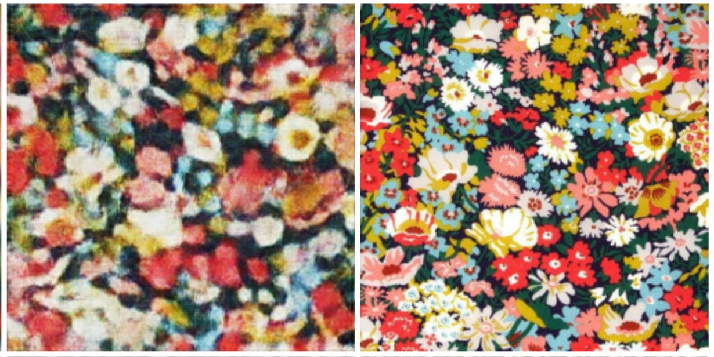
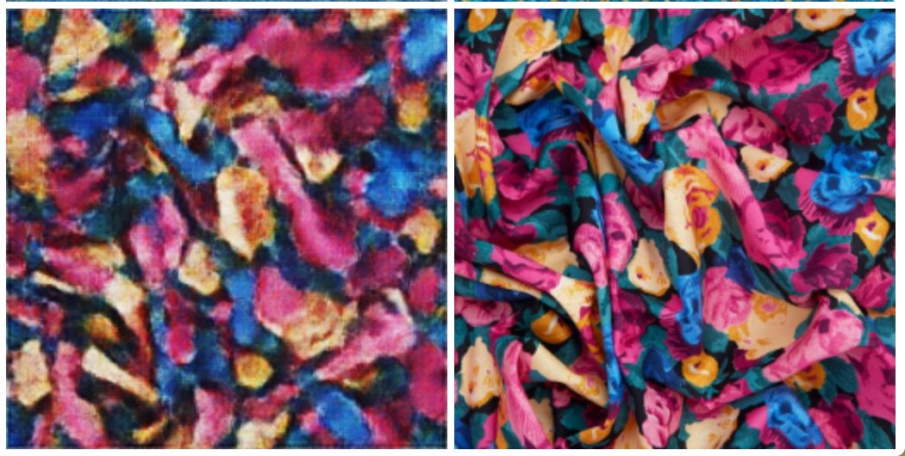
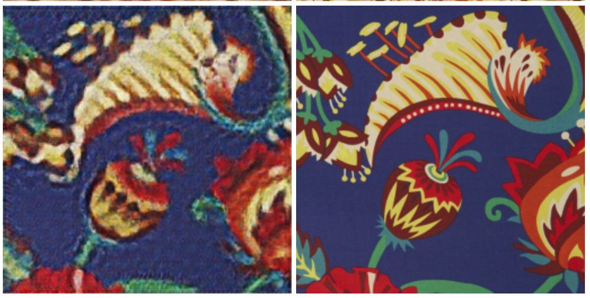

# Liberty Prints

Liberty prints takes prints from Liberties, whom are world renowned textile designers and trains a Pix2Pix model on them.

Pix2Pix takes two sets of images, A and B, where they are a set of image pairs, such that one image can be a blurred image and the other high resolution. This project does exactly that; trains on a set of blurred and high resolution images. Thus when the trained model is tested by giving it a blurred image it can attempt to recreate the high resolution image - hence filling in the pattern.

Examples are shown below, where the left is the response of the trained model and the right is the given image before blurring.

## Alternatives

Blurring is very much a quick hack to this project, as we can do other things such as colour unification so the model tries to infer the pattern based on a restricted colour map.

Another alternative is to use the Holistic Edge Detection algorithm so we create stroke images and the model can fill these in as such.

## pix2pix-tensorflow

Using Pix2Pix Tensorflow, based on [pix2pix](https://phillipi.github.io/pix2pix/) by Isola et al.

[Article about this implemention](https://affinelayer.com/pix2pix/)

Tensorflow implementation of pix2pix.  Learns a mapping from input images to output images, like these examples from the original paper:

This port is based directly on the torch implementation, and not on an existing Tensorflow implementation.  It is meant to be a faithful implementation of the original work and so does not add anything.  The processing speed on a GPU with cuDNN was equivalent to the Torch implementation in testing.
